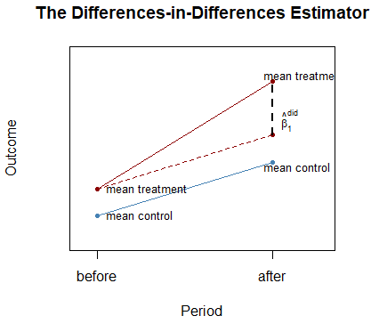
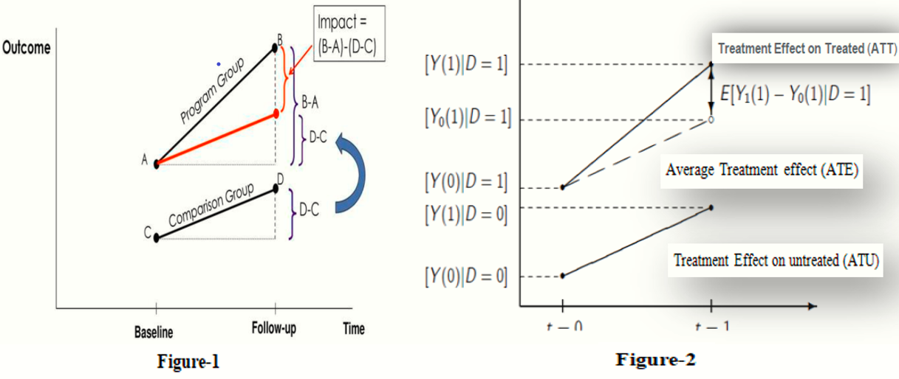
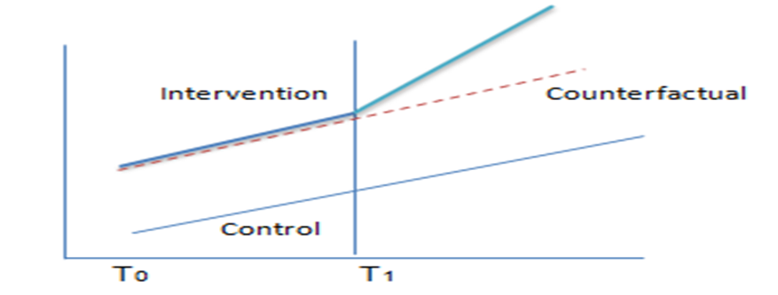

```{r setup, include=FALSE}
knitr::opts_chunk$set(echo = TRUE)
library(dplyr)
library(kableExtra)
library(ggplot2)
library(pander)
library(gridExtra)
library(stargazer)
```


## \textcolor{pink}{Outlines}

- Introduction
- Difference-in-Differences (DiD)
  - DiD- Graphically
  - Mathematical derivations
  - Estimation
- Assumptions of DID
- Demonstration (Practical Examples)
- Conclusion 


## \textcolor{pink}{Introduction}

- Public health policies, programs or interventions are designed to change desired outcomes.
- Measuring  the effect of intervention is the ultimate goal.
- However, estimating the \textcolor{orange}{impact of the intervention} is not easy task.   		
- Ideally, actual causal effect of treatment or impact of the intervention estimated by comparing outcomes under \textcolor{orange}{counterfactual} condition.
- **Counterfactual** measures \textcolor{cyan}{what would have happened to treated unit in the absence of the intervention}.
- The counterfactual estimate is represented by **comparison  group**.      


## \textcolor{pink}{Introduction}

- Ensuring the control and treatment groups **similar both in observed and unobserved** is *critical and remains a challenge*.
- If they are the same, any difference on outcome after the intervention can be attributed to the intervention.
- Randomized evaluation of the intervention is the \textcolor{orange}{most reliable method for measuring the impact of an intervention}. 
- However, random assignment is **not always possible due to the ethical and feasibility issues*, \textcolor{cyan}{Quasi-experimental research designs} is alternative ways \textcolor{orange}{(Hsueh-Sheng Wu, 2020)}.

## \textcolor{pink}{Difference-in-Differences (DiD)}

- The \textcolor{orange}{DID design} is \textcolor{cyan}{a quasi-experimental alternative} to the well understood and straight forward RCT design.
   - \textcolor{blue}{use data from treatment and control groups} to obtain an appropriate counterfactual to estimate a causal effect.
- DiD methods exploit variation in time (before vs. after) and across groups (treated vs. untreated) to recover causal effects of interest.
- \textcolor{orange}{Pre vs. Post comparisons}
  -  \textcolor{cyan}{Compares:} same individuals/communities/groups of units before and after program.
  -  \textcolor{red}{Limitation:} Does not account for potential trends in outcomes.
- \textcolor{orange}{Treated vs. Untreated comparisons}
  -  \textcolor{cyan}{Compares:} participants to those who have not experienced treatment (at least not yet).
  -  \textcolor{red}{Limitation:} Selection - is participation driven by other factors?
  
## \textcolor{pink}{Difference-in-Differences (DiD)}
  
- DiD \textcolor{orange}{combines these two approaches} to **avoid their pitfalls**.
- The DiD approach includes a before-after comparison for a treatment and control group. 
- This is a combination of:
  - \textcolor{cyan}{a cross-sectional comparison} (= compare a sample that was treated to an non-treated control group)
  - \textcolor{cyan}{a before-after comparison} (= compare treatment group with itself, before and after the treatment)
- The before-after difference in the treatment group gets a correction, by accounting for the before-after difference in the control group, eliminating the trend problem. 

## \textcolor{pink}{Difference-in-Differences (DiD)}

- To obtain an unbiased estimate of the treatment effect one needs to make **a parallel trend assumption**.
  - i.e. Treatment group would have had the same changes as the control group in absence of the treatment (\textcolor{orange}{counterfactual outcome}).

```{r, out.width='60%', fig.align='left', echo=FALSE, fig.align='center', fig.width=12}

```

## \textcolor{pink}{DiD- Graphically }

```{r, out.width='100%', fig.align='left', echo=FALSE}

```

- \textcolor{blue}{Data requirements:}
  - Panel or Repeated cross-sectional data
    - \textcolor{orange}{Two groups:} control and treatment groups 
    - \textcolor{orange}{Two time periods:} baseline, follow-up/end line \textcolor{blue}{(Kreif, Grieve et al.2016}.
    
## Derivation

- We assume that the outcome is determined by \textcolor{red}{$Y_{it}= c_i+d_t+\delta D_{it}+\eta_{it}$},
where i indexes the unit of observation and t indexes time. 
- $c_i$ is a variable(s) \textcolor{cyan}{do not change by time} but do change by unit. 
- $d_t$ is a variable(s) \textcolor{cyan}{do not change by unit} but can change by time.
- $\eta_{it}$ is an unexplained, random error.

## Differencing

1) \textcolor{orange}{Treated group} after and before: 

$E[Y_{i1}|D_i=1]-E[Y_{i0}|D_i=1]=c_i+d_1+\delta_1-(c_i+d_0+\delta_0)$

2) \textcolor{orange}{Control group} after and before: 
$E[Y_{i1}|D_i= 0]- E[Y_{i0}|D_i = 0]= c_i+d_1-(c_i+d_0)= d_1-d_0$ 
	
- The difference of the differences (1)-(2) is \textcolor{orange}{$ATE = d_1-d_0+ \delta -(d_1-d_0) = \delta$}.

- we can extend our notation to condition for a vector of covariates **$X_{it}$**, 
- So now we have: $Y_{it}=c_i+d_t+ \delta D_{it} + \textcolor{red}{X_{0it}\beta} + \eta_{it}$. 

## \textcolor{pink}{Estimation}

- We often do a before and after comparison, even when we have more time points.
  - \textcolor{cyan}{So we only need four means to estimate a DiD design}. 
- A before and after comparison of outcome Y for the treated is: \textcolor{blue}{$E[Y_{tpost}] - E[Y_{tpre}]$}. 
- We want to compare that difference with the difference in the control: \textcolor{blue}{$E[Y_{cpost}] - E[Y_{cpre}]$}. 
- The estimate of interest is: \textcolor{cyan}{$DiD=E[Y_{tpost}]-E[Y_{tpre}]-{E[Y_{cpost}]-E[Y_{cpre}]}$}.
- No regression model here yet, but we could estimate those four means    
   - parametrically or nonparametrically or semiparametrically. 
- The difference above is the same as: $DiD=E[Y_{tpost}]-E[Y_{cpost}]-{E[Y_{tpre}]-E[Y_{cpre}]}$

## \textcolor{pink}{Assumptions of DiD}

1. \textcolor{orange}{Parallel Trend Assumption}

- Without treatment, the average change/trend in the outcome variable would be the same in the two groups \textcolor{orange}{(Mora 2015)}.

```{r, out.width='80%', fig.align='center', echo=FALSE}

```

## \textcolor{pink}{Assumptions of DID}

2. \textcolor{orange}{Stable unit treatment value assumption (SUTVA)}

- Subject's potential outcome depends only on its own treatment status, not by treatment status by the other unit.

3. \textcolor{orange}{No Spill-Over Effects assumption} 
  - The members of the comparison group should not be affected by the intervention.

## DD Practicalities

### Example: 2 Period, 2 Group Design

### Software

- DD can easily be defined and analyzed in all major statistical software packages: R, SAS, SPSS, Stata, etc.

### Shortcut: user-written "diff" command ...

- diff y, t(treated) p(time)
- Long way: Model the DiD interaction term ...
- generate did = time*treated 
- regress y time treated did
- or ...
- regress y time##treated

## Practical Example  

- Using "Dataset from Card & Krueger (1994)" study.
- The study was aimed to estimate effect on employment in fast food restaurants caused by increase minimum wage (about 19%, a relatively large increase from $4.25 to $5.05) in New Jersey in 1992.
- data obtained from February 1992 (before) and November 1992 (after).
- They used data from similar fast food restaurants in Pennsylvania, which did not change the minimum wage.  
- So the key elements are, two-period DiD: time, a policy change or treatment, a treated group.

## Structure

```{r, out.width='100%', fig.align='left', echo=FALSE}
knitr::include_graphics("ffg6.png")
```

- We have longitudinal data. 
- For each store i, we have two observations (balanced data). 
- So two pairs of observation are treated or controls for both periods.

## Estimator

- Estimate and compare means

```{r, out.width='80%', fig.align='left', echo=FALSE}
knitr::include_graphics("ffg8.png")
```

* DiD estimator

$did = y_{tpost} - y_{tpre} - (y_{cpost} - y_{cpre})=2.92$

## Estimator usig did command

- The single DiD treatment-effects estimations with **diff** requires three variables: 
   - outcome (fte) Full time employment, 
   - treated (treated)= (New Jersey = 1,  Pennsylvania = 0), and 
   - period (t)=(Feb. 1992 = 0, Nov. 1992 = 1) .
   - Covariates= Burger king (bk), Kentucky Fried Chicken (kfc), Roy Rogers (roys), Wend's (wendys)

- Command:  
```{r, eval=F}
diff fte, treated(treated) period(t)
```     

## STATA output with no covariates

```{r, out.width='80%', fig.align='left', echo=FALSE, fig.width=18}
knitr::include_graphics("ffg3.png")
```

- implies an increase in the number of employees by **2.914** (full time equivalent employment).

## DiD with covariates

- Estimate average treatment effect with covariates.
- Treatment exposure is not the only factor.
- Other covariates makes difference and treatment effect estimation biased ~include covariates in regression
- When control covariates are available in the dataset, diff allows them to be included with the option \textcolor{cyan}{cov(varlist)}. 
- In this case, the binary variables indicating the categories of the restaurants are provided
   
```{r, eval=FALSE}
DID  Model = diff Y, t(treated) p(time) cov(x_i) 
```
  
```{r, eval=FALSE}
diff fte,treated(treated)period(t)cov(bk kfc roys)
```

## STATA output with covariates

```{r, out.width='80%', fig.align='left', echo=FALSE, fig.width=18}
knitr::include_graphics("ffg4.png")
```

## Interpretation

- There was no evidence that the increased minimum wage induced an increase in unemployment in New Jersey using the DiD approach: 
- The finding was quite the contrary- the $0.80 minimum wage increase in New Jersey led to a 2.94 full-time equivalent (FTE) increase in employment.

## Estimation

- Regression adjustment using a parametric model: $FTE_{it} = \beta_0+\beta_1D_i + \beta_2Period_t+ \beta_3(D_i*Period_t) + \epsilon_{it}$
- Treatment D doesn't depend on time (a fast food restaurant i is treated or control in both periods), while period depends on time but it's the same by store i
- This is a saturated model; we will get four predicted means like what did before.
- But now we can test if the DiD estimator is statistically significant: $H_0 : \beta_3 = 0$.

## Regression approach 

- DiD estimator is not statistically significant at 0.05

```{r, out.width='80%', fig.align='left', echo=FALSE}
knitr::include_graphics("ffg9.png")
```

## Model interpretation reminder

- In general, we can show that the model is a differences of differences (using a version without covariates; with covariates we need to hold them constant)
  - E[Y] Treated in post period: $\beta_0 + \beta_1 + \beta_2 + \beta_3$
  - E[Y] Treated in pre period: $\beta_0 + \beta_1$

(1) Difference treated post - pre: $\beta_2 + \beta_3$
  - E[Y] Control in post period: $\beta_0 + \beta_2$
  - E[Y] Control in pre period: $\beta_0$

(2) Difference control post - pre: $\beta_2$
  - Difference of differences (1)-(2): $DiD = \beta_3$

- \textcolor{orange}{Caution:} \textcolor{blue}{Interacted models are not difference-in-differences research designs}, \textcolor{cyan}{but interactions with dummy variables are difference-in-differences}.

## Adding covariates

- There is a difference between chain restaurants in PA and NJ, so we could
control for this adding dummies for type of chain.

- We will leave Burger King as reference since it's the largest (doesn't really matter since we care about the $\beta_3$). 
- We can write the model as:$FTE_{it} = \beta_0+ \beta_1D_i+ \beta_2Period_t+ \beta_3(D_i*Period_t) +\alpha_i + \epsilon_{it}$
Note the $\alpha_i$. 

- That's a shortcut for writing dummy variables

## output

```{r, out.width='80%', fig.align='left', echo=FALSE, fig.width=18}
knitr::include_graphics("reg.png")
```

## How DiD estimate unbiased? 

- It requires that the expected outcomes of the treatment and control group in the absence of the intervention exhibited parallel trends. 
- When this assumption fails, DiD results in a biased estimate because it confounds changes unrelated to the intervention with the effect of the intervention.
- One popular method for reducing bias when outcome trends are not parallel is to first match treatment and control observations on pre-treatment outcomes before applying did on the matched sample \textcolor{orange}{(Ryan et al. 2015)}. 
- This approach is intuitively appealing: matching on outcomes corrects for non-parallel trends between the two groups while subsequent did eliminates any remaining outcome level differences.

  
## Conclusion

- In this presentation, I introduced a DiDs method for empact evaluation. 
- We need to understand the data to perform a robust analysis. 
- The DiD is a powerful technique if parallel assumption is satisffied. 
- If we combine it with the propensity score matching, then we would have a robust approach to estimate the treatment effect in non-randomized experiments. 
- At the same time, the classic regression approach allows us to estimate the effect of different covariates, and in the end returns comparable results.


